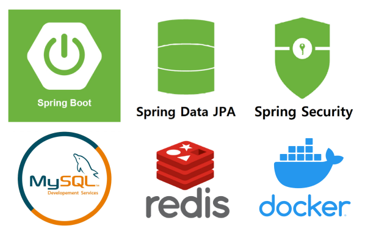

# mokumoku Backend Server

## 👨🏻‍💻Contributors

| 김경륜                                                                                                   | 김유진                                                                                                      | 엄한결                                                                                                                                         |
|:-----------------------------------------------------------------------------------------------------:|:--------------------------------------------------------------------------------------------------------:|:-------------------------------------------------------------------------------------------------------------------------------------------:|
|  |  |  |
| **백엔드/팀장**                                                                                            | **백엔드**                                                                                                  | **백엔드/CI/CD**                                                                                                                               |

커밋 컨벤션 rule : AngularJS Commit Message Convention

---

## ⚙개발 핵심 기능

